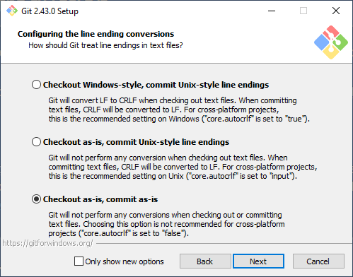
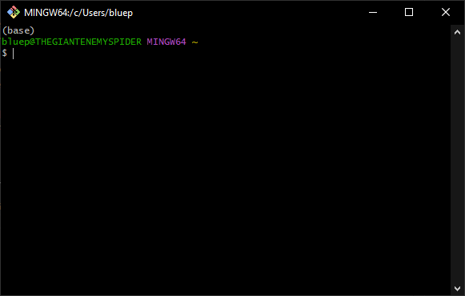
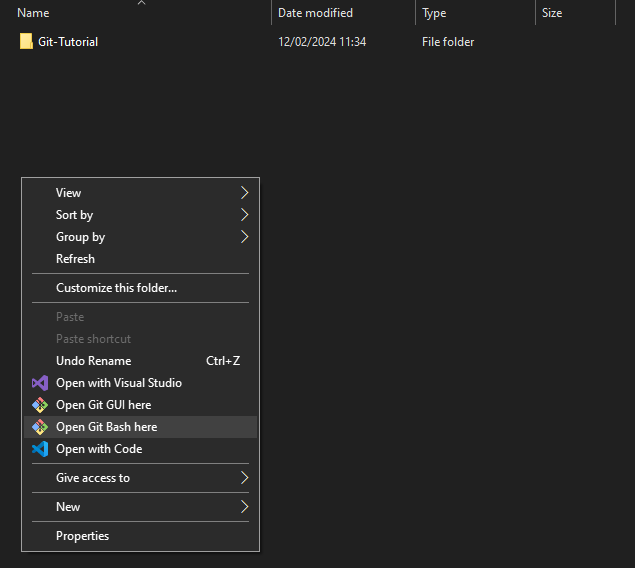
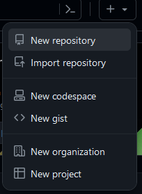
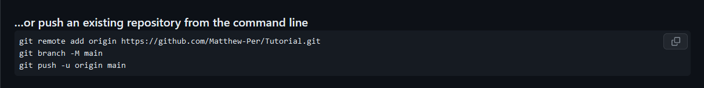
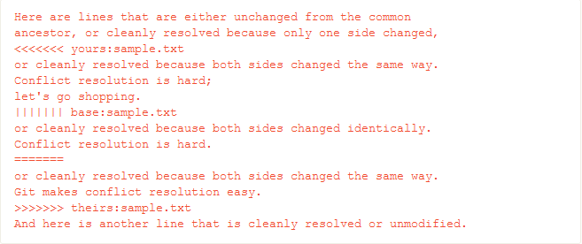

# A Basic Guide to Using Git
## What to Install
First things first go to this [link](https://git-scm.com/downloads
) to install Git and Bash

Choose your system and the best option for your system, I will show how to install for windows.

For windows my favorite method of installing is using a standard installer, so for almost all newer systems, a 64 bit installer is good.

Once done downloading open the installer and be sure to install. Keep the options on default unless you know what youre doing. 

The only option I would change is Checkout styles, as it depends on whether youre doing cross platform projects. Other than that just install default options.

## The Basics of Bash
After installing open Git Bash. It looks like a more colorful windows terminal. 

All git commands are preceeded by the keyword `git` such as git init.
A few basic command line commands include:
- cd: Change Directory, go from one folder to another
- ls: List, shows all child folders in current folder
- mkdir: create child folder in current folder
- help: shows all available commands

Using cd and ls can help you get to your wanted directory, however you can also use the command `Open Git Bash here` from windows explorer if you chose that option in the git installer.

## Getting into Git

Once you get to the directory you want to put your first git project in, to start, type `git init`, this will create the necessary components to be able to use git in the directory. You should see an output saying: `Initialized empty Git repository (path here)`.

Now if you want to have an online git repository you'll have to set it up from the site of your choosing, in this case I will use github. First create an account if you do not have one, after, on the home page, click the plus and press new repository.

From there name it, and choose what you want with it. depending on your project, .gitignore may be useful as to not commit unwanted items. Once create github will give a quick setup guide, in this case we will use the existing repository tutorial. 

Heres a quick rundown of what these commands do:
- git remote: Connects local repository to the remote repository, in this case github.
- git branch: create a new branch, in this case the main branch.
- git push: pushes all changes onto the remote branch.

Once this is done add whatever you want into your repository, and when youre ready to save your work into the repositroy these commands and concepts will help you do it:
- commits: a saved state in your git branch. 
- Staging tree: the area between your work and a commit.
- git add: adds specified changes to the staging tree, can be everything or only one thing. Example: `git add .` adds all files (except what .gitignore specifies and .git folder contents) to the commit.
- git commit: commits the contents of the staging tree to a commit, Example: `git commit -m "first commit"` -m in this case adds a human readable message to the commit, very useful for tracking progress.
- git push: pushes all changes in commits and history to the remote repository, Example: `git push`
- git pull: pulls changes from the remote repository and stores them in the local repository, Example `git pull`

From here you will be able to commit, push, and pull with ease, although there are more concepts to know for future projects.

## Branches

For the future branching and other git commands will be useful when a project becomes large or multiple people work on it. 

If you want to return to a working version of your project, `git stash` will return you to the last head commit, so if something goes awry using git stash can return you to a working state granted that head state was working. 

Branching is also a unique way of working with git, instead of following the main branch you can create more branches in order to differentiate between versions. Using `git branch (insert name)` to create branches and `git switch (branch name)` to move between branches will help in maintaining and using branches.

But say you want to remove a branch and add it to a main branch, thats where commands such as `git merge` where it will merge the specified branches into the current branch, example: `git merge versionOne`. However merging may have file conflicts, such as differing code and thanfully git will let you know what conflicts exist using markers like this: 

Resolving these conflicts then doing either `git commit` or `git merge --continue` will then finish the merge and the two (or more) branches will become one.

## An Example
Here is a quick little tutorial from initialization to branching.